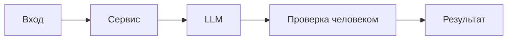

# ADR: решение для первого рабочего сценария

- Статус: proposed / accepted
- Дата: 2026-09-09
- Ответственные: команда разработки сервиса ревью

## Контекст

Сервис получает diff PR и пересылает его во внешний LLM. По CASE.md действуют правила SEC-1, API-1, REL-1, OUT-1, SCOPE-1, QA-1, OBS-1. Текущая версия нарушает несколько из них.
## Решение

Ввести валидацию входа и ограничение размера (413), редакцию секретов, таймаут 10s и контролируемую обработку ошибок, структурировать ответ по OUT-1 и вести минимальное логирование по OBS-1. Не расширять полномочия сервиса за пределы SCOPE-1.
## Рассмотренные альтернативы

| Альтернатива | Почему не выбрали сейчас |
|---|---|
| Передавать diff как есть | Нарушает SEC-1 и повышает риски утечки |
| Свободный текст вместо OUT-1 | Непригодно для автоматической проверки и нарушает OUT-1 |
| Отсутствие таймаута | Нарушает REL-1, ведёт к нестабильности |

## Последствия и главный риск

- Положительные последствия:
- Ограничения:
- Главный риск:
- Как проверим риск:

- Положительные последствия:
  - Соблюдение требований безопасности и стабильности
  - Предсказуемая стоимость и производительность
- Ограничения:
  - Нужны доп. вычисления на санитайзинг и пост-обработку
- Главный риск:
  - Ложно-положительная редакция (скрытие полезных фрагментов) или ложно-отрицательная (утечка)
- Как проверим риск:
  - Набор тестов с синтетическими секретами и контрольными примерами

## Архитектурная схема

## Как использовали AI

- Для чего:
- Тип промпта:
- Строка в [`prompts.md`](prompts.md):
- Что проверили и исправили сами:
