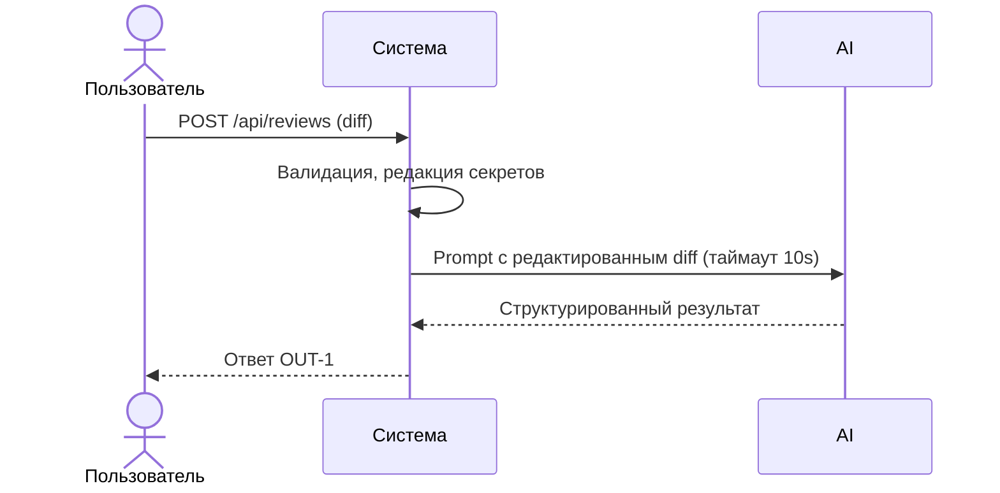

# Use cases и user stories

## Первый рабочий сценарий

**Когда** пользователь отправляет diff PR в сервис, **система** валидирует и обрабатывает его по правилам (SEC-1, API-1, REL-1, OUT-1), **а пользователь получает** структурированное ревью с тремя подтверждёнными рисками и списком проверок.

Не входит в этот сценарий:

- Автоматическое исправление кода, действия в GitHub (SCOPE-1)

## Use case

| Поле | Значение |
|---|---|
| Актор | Клиент API |
| Триггер | POST /api/reviews с полем diff |
| Предусловия | Доступность сервиса; корректный формат тела запроса |
| Основной результат | Ответ по OUT-1: summary, <=3 risks, checks |
| Ошибка или отказ | 413 при diff>20k; контролируемый ответ при таймауте LLM |



## User stories и acceptance criteria

```gherkin
Feature:

  Scenario: Позитивный
    Given корректный diff < 20k символов
    When отправляем POST /api/reviews
    Then получаем 200 и JSON со structure summary, risks<=3 с evidence и checks

  Scenario: Негативный или граничный
    Given diff длиной > 20000 символов
    When отправляем POST /api/reviews
    Then получаем 413 и тело с описанием ошибки без обращения к LLM
```

## Как использовали AI

- Для чего: описать пользовательский сценарий на основе CASE.md и diff
- Тип промпта: master prompt
- Строка в [`prompts.md`](prompts.md): P1-02
- Что проверили и исправили сами: ограничили сценарии рамками SCOPE-1 и правил
