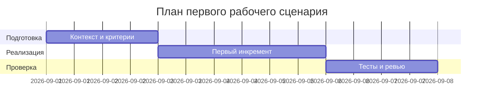

# План поставки

## Инкременты и ответственность

| Инкремент | Наблюдаемый результат | Что делает человек | Что делает AI или субагент | Проверка | Зависимости |
|---|---|---|---|---|---|
| 1 | Валидация входа и 413 для длинного diff | Определяет порог, утверждает контракт | Реализует проверку и ошибки | Интеграционный тест >20k | CASE.md API-1 |
| 2 | Санитайзер секретов | Утверждает список паттернов | Реализует редакцию и тесты | Юнит-тесты на токены | CASE.md SEC-1 |
| 3 | Таймаут и контролируемый ответ | Определяет политики | Реализует таймаут и маппинг ошибок | Тест на таймаут | CASE.md REL-1 |

## Диаграмма Ганта

Замените даты и задачи на свой план.

## Как использовали AI

- Для чего: зафиксировать план поставки по правилам CASE.md
- Тип промпта: master prompt
- Строка в [`prompts.md`](prompts.md): P1-02
- Что проверили и исправили сами: увязали инкременты с SEC-1, API-1, REL-1
