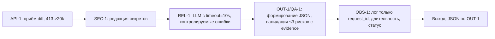

# ADR: решение для первого рабочего сценария (обновление по RAG)

- Статус: proposed
- Дата: 2026-09-19
- Ответственные: команда разработки сервиса ревью
- Критерий принятия (accepted): пройдут проверки `tests_unit.md`, `tests_integration.md`, `tests_e2e.md`, `tests_load.md` на соблюдение SEC-1, API-1, REL-1, OUT-1, QA-1, OBS-1.

## Контекст

Сервис получает diff PR и пересылает его во внешний LLM. По правилам репозитория действуют SEC-1, API-1, REL-1, OUT-1, SCOPE-1, QA-1, OBS-1 (см. CASE.md). Текущая версия нарушает несколько из них (см. P1-02.md).

## Решение + Как проверим

- SEC-1: перед отправкой в LLM из diff удаляются токены, пароли и приватные ключи.
  Как проверим: unit-тест «SEC-1 | Редакция секретов в diff» заменяет секреты на `[REDACTED]` (см. practices/practice_01/tests_unit.md).

- API-1: diff длиной > 20 000 символов отклоняется с HTTP 413.
  Как проверим: integration-тест «Превышение размера diff» ожидает 413 без обращения к LLM (см. practices/practice_01/tests_integration.md).

- REL-1: внешний LLM-вызов имеет timeout 10 секунд; ошибка превращается в контролируемый ответ.
  Как проверим: integration-тест «Таймаут/ошибка LLM» ожидает контролируемый ответ по OUT-1 (см. practices/practice_01/tests_integration.md) и e2e-тест «Негативный сценарий» без 500 (см. practices/practice_01/tests_e2e.md).

- OUT-1: ответ содержит `summary`, массив `risks` (≤3 элемента с `file`, `line`, `evidence`, `risk`) и массив `checks`.
  Как проверим: unit-тест «OUT-1 | Ограничение risks<=3 и наличие evidence» обрезает до 3 и отбрасывает без доказательств (см. practices/practice_01/tests_unit.md); e2e-тест «Позитивный» ожидает JSON по OUT-1 (см. practices/practice_01/tests_e2e.md).

- QA-1: в ответ включаются только риски, подтверждённые строкой diff или правилом репозитория; максимум три риска.
  Как проверим: unit-тест по OUT-1 ограничивает список и требует `evidence` (см. practices/practice_01/tests_unit.md).

- OBS-1: логируем только `request_id`, длительность и статус; содержимое diff и ответ модели не логируются.
  Как проверим: интеграционные/наблюдательные проверки в рамках сценариев не допускают логирования содержимого; подтверждение — сценарии в practices/practice_01/tests_integration.md и соблюдение ограничения в описании CASE.md.

Ссылки на правила: см. practices/practice_01/CASE.md (SEC-1, API-1, REL-1, OUT-1, SCOPE-1, QA-1, OBS-1). Детализация нарушений и способы исправления: см. practices/practice_01/P1-02.md.

## Рассмотренные альтернативы

| Альтернатива | Почему не выбрали сейчас |
|---|---|
| Передавать diff как есть | Нарушает SEC-1 и повышает риски утечки (см. CASE.md) |
| Свободный текст вместо OUT-1 | Непригодно для автоматической проверки и нарушает OUT-1 |
| Отсутствие таймаута | Нарушает REL-1, ведёт к нестабильности |

## Последствия и главный риск

- Положительные последствия: соблюдение требований безопасности и стабильности; предсказуемая стоимость и производительность.
- Ограничения: дополнительные вычисления на санитайзинг и пост-обработку.
- Главный риск: ложно-положительная редакция (скрытие полезных фрагментов) или ложно-отрицательная (утечка).
- Как проверим риск: unit-проверки с синтетическими секретами и контрольными примерами (см. practices/practice_01/tests_unit.md).

## Архитектурная схема

## Как использовали AI

- Тип промпта: RAG
- Строка в [`prompts.md`](../prompts.md): RAG
- Что проверили и исправили сами: убрали дубли в «Последствиях», связали действия с проверками tests_* и обновили схему согласно CASE.md без добавления новых фактов.
