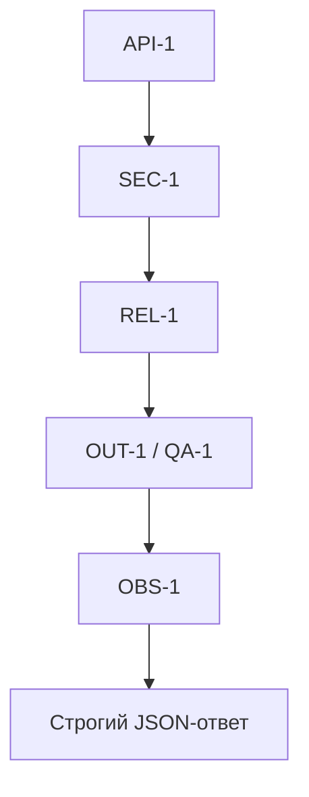

# ADR: Обновление по SEC-1, API-1, REL-1, OUT-1, QA-1, OBS-1

## Статус и критерий принятия

- Статус: proposed
- Критерий accepted: пройти проверки из `tests_unit.md`, `tests_integration.md`, `tests_e2e.md`, `tests_load.md` на соблюдение правил `SEC-1`, `API-1`, `REL-1`, `OUT-1`, `QA-1`, `OBS-1`.
  - Unit: [tests_unit.md](../../practice_01/tests_unit.md)
  - Integration: [tests_integration.md](../../practice_01/tests_integration.md)
  - E2E: [tests_e2e.md](../../practice_01/tests_e2e.md)
  - Load: [tests_load.md](../../practice_01/tests_load.md)

## Контекст

По правилам репозитория из [CASE.md](../../practice_01/CASE.md):

- `SEC-1`: перед отправкой во внешний LLM из diff удаляются токены, пароли и приватные ключи.
- `API-1`: diff длиннее 20 000 символов отклоняется с HTTP 413.
- `REL-1`: внешний LLM-вызов имеет timeout 10 секунд; ошибка превращается в контролируемый ответ.
- `OUT-1`: ответ содержит `summary`, массив `risks` (максимум 3, с полями `file`, `line`, `evidence`, `risk`) и массив `checks`.
- `SCOPE-1`: сервис советует; не пишет код и не выполняет действия в GitHub. (зафиксировано как граница, не влияет на контракт ответа)
- `QA-1`: риск включается в ответ, только если подтверждён строкой diff или правилом репозитория.
- `OBS-1`: в лог пишутся только `request_id`, длительность и статус; содержимое diff и ответы модели не логируются.

Проблемы, выявленные в [P1-02.md](../../practice_01/P1-02.md), указывают на несоответствие текущей реализации `SEC-1`, `API-1`, `REL-1`, `OUT-1`, `QA-1` и отсутствующее логирование по `OBS-1`.

## Решение и как проверим

Для каждого правила определены действие и способ проверки через tests_*:

1. SEC-1
   - Действие: перед формированием prompt к LLM пропускать `diff` через санитайзер, заменяющий секреты на `[REDACTED]` по шаблонам токенов/ключей; не отправлять исходные секреты во внешний LLM.
   - Как проверим: unit-тесты подтверждают редакцию секретов: [tests_unit.md](../../practice_01/tests_unit.md), строка «SEC-1 | Редакция секретов в diff → [REDACTED]».

2. API-1
   - Действие: при `len(diff) > 20000` возвращать `HTTP 413` без обращения к LLM; граничное значение `20000` допускается.
   - Как проверим: интеграционный тест на превышение размера: [tests_integration.md](../../practice_01/tests_integration.md) (API → ReviewService → LLM, 413, без обращения к LLM); E2E граничный сценарий `diff=ровно 20000`: [tests_e2e.md](../../practice_01/tests_e2e.md).

3. REL-1
   - Действие: обернуть внешний LLM-вызов таймаутом 10 секунд; при таймауте/ошибке возвращать контролируемый ответ, соответствующий `OUT-1`, без `500`.
   - Как проверим: интеграционный сценарий таймаута: [tests_integration.md](../../practice_01/tests_integration.md) («Таймаут/ошибка LLM → контролируемый ответ по OUT-1»); E2E негативный сценарий без `500`: [tests_e2e.md](../../practice_01/tests_e2e.md).

4. OUT-1
   - Действие: формировать ответ строго с полями `summary`, `risks` (≤3, каждый с `file`, `line`, `evidence`, `risk`) и `checks`; валидировать и нормализовать выход LLM.
   - Как проверим: unit-тест «OUT-1 | Ограничение risks≤3 и наличие evidence»: [tests_unit.md](../../practice_01/tests_unit.md); E2E позитивный сценарий — `200; JSON по OUT-1`: [tests_e2e.md](../../practice_01/tests_e2e.md).

5. QA-1
   - Действие: включать риск в ответ только при наличии подтверждения строкой из diff (`evidence`) или ссылкой на правило; отбрасывать риски без `evidence`; ограничивать риски тремя.
   - Как проверим: unit-тест на обрезку и фильтрацию рисков (см. OUT-1): [tests_unit.md](../../practice_01/tests_unit.md); интеграционные/E2E сценарии должны возвращать структурированный ответ с подтверждёнными рисками: [tests_integration.md](../../practice_01/tests_integration.md), [tests_e2e.md](../../practice_01/tests_e2e.md).

6. OBS-1
   - Действие: добавить структурированное логирование только разрешённых полей: `request_id`, длительность и статус; не логировать содержимое `diff` и ответы модели.
   - Как проверим: при прохождении интеграционных и E2E сценариев инспектировать логи тестового стенда на отсутствие `diff` и тела ответа; наличие только `request_id`, длительности и статуса. Ссылка на сценарии: [tests_integration.md](../../practice_01/tests_integration.md), [tests_e2e.md](../../practice_01/tests_e2e.md), а также нагрузочный прогон: [tests_load.md](../../practice_01/tests_load.md).

## Альтернативы

- Оставить текущую реализацию без редакции секретов и строгого контракта — отклонено: нарушает `SEC-1` и `OUT-1`.
- Увеличить лимит diff > 20000 — отклонено: противоречит `API-1` и тестам.
- Логировать подробности диффа/ответа для диагностики — отклонено: нарушает `OBS-1`.

## Последствия и главный риск

- Последствия: появится обязательная предобработка diff, строгая схема ответа и ограничения API; обработка ошибок станет предсказуемой; логирование будет минимальным по `OBS-1`.
- Главный риск: излишняя редакция может скрыть значимый контекст в diff; требуется балансировать шаблоны санитайзера и подтверждение рисков по `QA-1`.

## Схема

## Как использовали AI

- Тип: R.C.T.F.
- Ссылка: [prompts.md](../prompts.md)
- Что исправили сами: убрали дубли, связали «Решение + Как проверим» с tests_* из Практики 1, оставили только факты из [CASE.md](../../practice_01/CASE.md), [P1-02.md](../../practice_01/P1-02.md) и tests_*.
