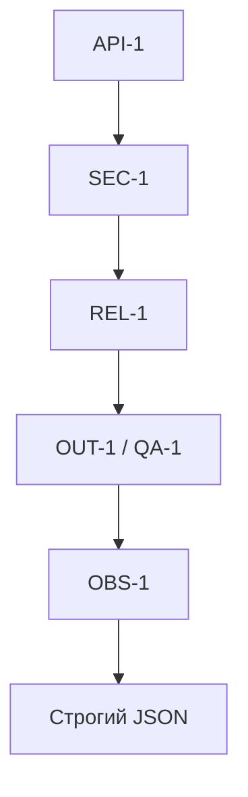

# ADR: Обновление по SEC-1, API-1, REL-1, OUT-1, QA-1, OBS-1

## Статус и критерий принятия

- Статус: proposed
- Критерий accepted: пройти проверки из `tests_unit.md`, `tests_integration.md`, `tests_e2e.md`, `tests_load.md` на соблюдение правил `SEC-1`, `API-1`, `REL-1`, `OUT-1`, `QA-1`, `OBS-1`.
  - Unit: [tests_unit.md](../../practice_01/tests_unit.md)
  - Integration: [tests_integration.md](../../practice_01/tests_integration.md)
  - E2E: [tests_e2e.md](../../practice_01/tests_e2e.md)
  - Load: [tests_load.md](../../practice_01/tests_load.md)

## Контекст

Правила репозитория из [CASE.md](../../practice_01/CASE.md):

- SEC-1: перед отправкой во внешний LLM из diff удаляются токены, пароли и приватные ключи.
- API-1: diff длиннее 20 000 символов отклоняется с HTTP 413.
- REL-1: внешний LLM-вызов имеет timeout 10 секунд; ошибка превращается в контролируемый ответ.
- OUT-1: ответ содержит `summary`, массив `risks` (максимум 3, с полями `file`, `line`, `evidence`, `risk`) и массив `checks`.
- SCOPE-1: сервис только советует; он не пишет код и не выполняет действия в GitHub.
- QA-1: риск включается в ответ, только если подтверждён строкой diff или правилом репозитория.
- OBS-1: в лог пишутся только `request_id`, длительность и статус; содержимое diff и ответа модели не логируется.

## Решение и как проверим

Для каждого правила фиксируем действие и способ проверки через tests_*:

1. SEC-1
   - Действие: перед формированием prompt к LLM пропускать `diff` через санитайзер, заменяющий секреты на `[REDACTED]`; не отправлять исходные секреты во внешний LLM.
   - Как проверим: unit — «SEC-1 | Редакция секретов в diff → [REDACTED]»: [tests_unit.md](../../practice_01/tests_unit.md).

2. API-1
   - Действие: при `len(diff) > 20000` возвращать `HTTP 413` без обращения к LLM; граничное значение `20000` допускается.
   - Как проверим: integration — превышение размера (413, без обращения к LLM): [tests_integration.md](../../practice_01/tests_integration.md); E2E — граничный `diff=20000`: [tests_e2e.md](../../practice_01/tests_e2e.md).

3. REL-1
   - Действие: обернуть внешний LLM-вызов таймаутом 10 секунд; при таймауте/ошибке возвращать контролируемый ответ, соответствующий `OUT-1`, без `500`.
   - Как проверим: integration — таймаут/ошибка LLM → контролируемый ответ по OUT-1: [tests_integration.md](../../practice_01/tests_integration.md); E2E — негативный сценарий без `500`: [tests_e2e.md](../../practice_01/tests_e2e.md).

4. OUT-1
   - Действие: формировать ответ строго с полями `summary`, `risks` (≤3, у каждого `file`, `line`, `evidence`, `risk`) и `checks`; валидировать и нормализовать выход LLM.
   - Как проверим: unit — «OUT-1 | Ограничение risks≤3 и наличие evidence»: [tests_unit.md](../../practice_01/tests_unit.md); E2E — позитивный сценарий «200; JSON по OUT-1»: [tests_e2e.md](../../practice_01/tests_e2e.md).

5. QA-1
   - Действие: включать риск в ответ только при наличии подтверждения строкой diff (`evidence`) или ссылкой на правило; отбрасывать риски без `evidence`; ограничивать риски тремя.
   - Как проверим: unit — фильтрация/обрезка рисков (см. OUT-1): [tests_unit.md](../../practice_01/tests_unit.md); также проверка структурированного ответа в integration/E2E: [tests_integration.md](../../practice_01/tests_integration.md), [tests_e2e.md](../../practice_01/tests_e2e.md).

6. OBS-1
   - Действие: писать в лог только `request_id`, длительность и статус; не логировать содержимое `diff` и ответы модели.
   - Как проверим: при выполнении integration, E2E и нагрузочного прогона инспектировать логи тестового стенда на отсутствие `diff` и тела ответа; наличие только разрешённых полей. Сценарии: [tests_integration.md](../../practice_01/tests_integration.md), [tests_e2e.md](../../practice_01/tests_e2e.md), [tests_load.md](../../practice_01/tests_load.md).

## Альтернативы (отклонены)

- Передавать diff как есть — нарушает SEC-1.
- Свободный текст вместо контракта OUT-1 — нарушает OUT-1 и мешает проверкам.
- Увеличить лимит diff > 20000 — противоречит API-1 и tests_*.
- Логировать содержимое diff/ответа — нарушает OBS-1.

## Последствия и главный риск

- Последствия: обязательная предобработка diff, строгий контракт ответа, предсказуемая обработка ошибок и минимальное логирование.
- Главный риск: избыточная редакция может скрыть полезный контекст в diff; требуется аккуратная настройка санитайзера при соблюдении QA-1.

## Схема

## Как использовали AI

- Тип: ReAct
- Ссылка: [prompts.md](../prompts.md)
- Что исправили сами: сопоставили правила с tests_* из Практики 1, убрали дубли и пустые пункты, оформили «Действие + Как проверим» только на основе [CASE.md](../../practice_01/CASE.md) и tests_*.
