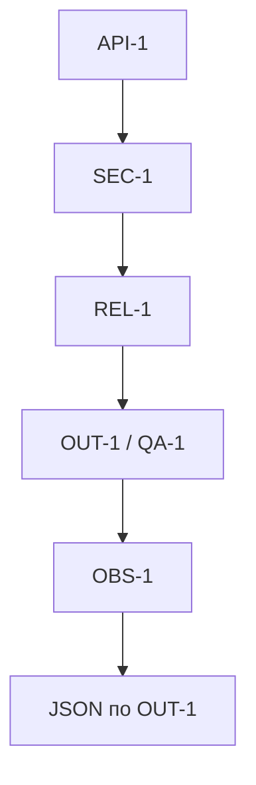
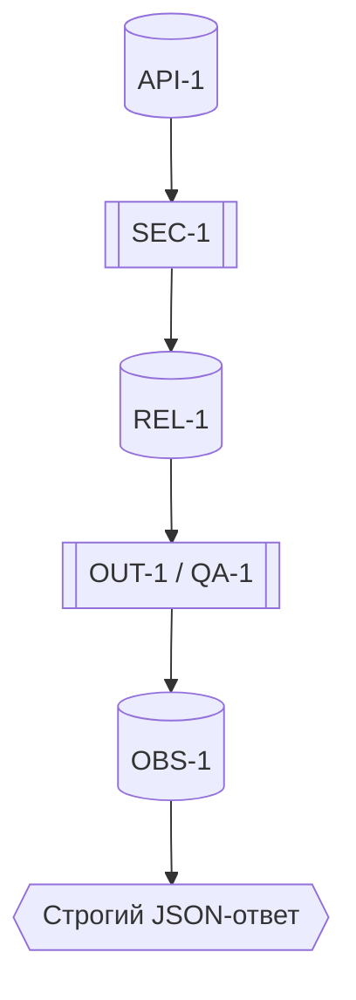
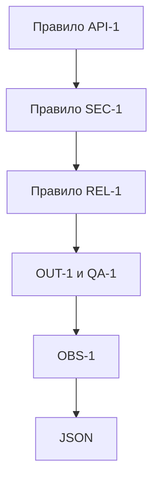

# Tree of Thoughts

- Решение, для которого нужны альтернативы:
- Формулировки раздела ADR «Решение и как проверим» по правилам SEC-1, API-1, REL-1, OUT-1, QA-1, OBS-1 на основе фактов из CASE.md и tests_*.
- Критерии выбора:
  - Подтверждаемость tests_*
  - Согласованность с CASE.md
  - Краткость
  - Отсутствие дублей
  - Ясность

## Запрос
Обновить ADR без новых фактов, статус=proposed; критерий accepted — пройти `tests_unit.md`, `tests_integration.md`, `tests_e2e.md`, `tests_load.md`. Для SEC-1/API-1/REL-1/OUT-1/QA-1/OBS-1 дать «Действие + Как проверим» со ссылками на tests_*; добавить краткие «Последствия и главный риск»; вставить Mermaid-схему API-1→SEC-1→REL-1→OUT-1/QA-1→OBS-1→JSON; описать «Как использовали AI»: Tree of Thoughts, ссылка на prompts.md, что исправили сами. Источники: [CASE.md](../../practice_01/CASE.md), [tests_unit.md](../../practice_01/tests_unit.md), [tests_integration.md](../../practice_01/tests_integration.md), [tests_e2e.md](../../practice_01/tests_e2e.md), [tests_load.md](../../practice_01/tests_load.md).

## Внешне описанные альтернативы

| Альтернатива | Плюсы | Минусы | Оценка по критериям |
|---|---|---|---|
| A (лаконичная, императивная) | Краткая, прямая формулировка; явные ссылки на tests_* | Менее детализирует контекст проверки логов OBS-1 | Подтверждаемость: высокая; Согласованность: высокая; Краткость: высокая; Дублей: нет; Ясность: высокая |
| B (контекстная, разъясняющая) | Чуть подробнее связывает правила и сценарии из tests_* | Длиннее; риск повторов | Подтверждаемость: высокая; Согласованность: высокая; Краткость: средняя; Дублей: нет; Ясность: высокая |
| C (нормативная, с валидацией) | Акцент на валидации OUT-1/QA-1 и проверке границ API-1 | Может выглядеть жёстко; OBS-1 проверка описана косвенно | Подтверждаемость: высокая; Согласованность: высокая; Краткость: средняя; Дублей: нет; Ясность: высокая |

Ветвь A — «Действие + Как проверим»:
- SEC-1: Действие — перед вызовом LLM санитайзить diff, заменяя токены/ключи на `[REDACTED]`. Как проверим — unit «SEC-1 | Редакция секретов в diff → [REDACTED]»: [tests_unit.md](../../practice_01/tests_unit.md).
- API-1: Действие — при `len(diff) > 20000` возвращать `413` без обращения к LLM; `20000` допускается. Как проверим — integration «>20k → 413 без LLM»: [tests_integration.md](../../practice_01/tests_integration.md); E2E «ровно 20000 → 200»: [tests_e2e.md](../../practice_01/tests_e2e.md).
- REL-1: Действие — таймаут внешнего LLM 10s; при таймауте/ошибке — контролируемый ответ по OUT-1, без 500. Как проверим — integration «таймаут/ошибка LLM → контролируемый ответ»: [tests_integration.md](../../practice_01/tests_integration.md); E2E «негативный без 500»: [tests_e2e.md](../../practice_01/tests_e2e.md).
- OUT-1: Действие — возвращать JSON с `summary`, `risks` (≤3, `file`,`line`,`evidence`,`risk`) и `checks`; нормализовать/обрезать лишнее. Как проверим — unit «risks≤3 и evidence»: [tests_unit.md](../../practice_01/tests_unit.md); E2E «200; JSON по OUT-1»: [tests_e2e.md](../../practice_01/tests_e2e.md).
- QA-1: Действие — включать только подтверждённые риски (по строке diff или правилу); без evidence — отбрасывать; ≤3. Как проверим — unit (см. OUT-1): [tests_unit.md](../../practice_01/tests_unit.md); структурированный ответ в integration/E2E: [tests_integration.md](../../practice_01/tests_integration.md), [tests_e2e.md](../../practice_01/tests_e2e.md).
- OBS-1: Действие — логировать только `request_id`, длительность и статус; diff и ответы модели не логировать. Как проверим — при запуске integration/E2E/load инспектировать логи стенда: отсутствуют diff/тело ответа; есть только разрешённые поля: [tests_integration.md](../../practice_01/tests_integration.md), [tests_e2e.md](../../practice_01/tests_e2e.md), [tests_load.md](../../practice_01/tests_load.md).
- Последствия/риск — кратко: «Строгие границы API/LLM и выходного JSON; минимальные логи. Риск: чрезмерная редакция diff скрывает контекст; баланс по QA-1».
- Схема — см. Mermaid A.

Ветвь B — «Действие + Как проверим»:
- SEC-1: Санитайзер diff перед формированием prompt, шаблоны для токенов/ключей; запрещена отправка секретов. Проверка — unit «SEC-1 [REDACTED]»: [tests_unit.md](../../practice_01/tests_unit.md).
- API-1: Контроль длины diff в API-слое: `>20000` → `413`, граничное `20000` допускается. Проверка — integration «>20k→413 без LLM»: [tests_integration.md](../../practice_01/tests_integration.md) и E2E «ровно 20000→200»: [tests_e2e.md](../../practice_01/tests_e2e.md).
- REL-1: Таймаут 10s на внешний LLM и graceful degradation до OUT-1-совместимого ответа. Проверка — integration «таймаут/ошибка LLM»: [tests_integration.md](../../practice_01/tests_integration.md); E2E «негативный без 500»: [tests_e2e.md](../../practice_01/tests_e2e.md).
- OUT-1: Валидация структуры: `summary`, `risks`≤3 с обязательным `evidence`, `checks`; фильтрация выходов LLM. Проверка — unit «risks≤3/evidence»: [tests_unit.md](../../practice_01/tests_unit.md); E2E «200; JSON по OUT-1»: [tests_e2e.md](../../practice_01/tests_e2e.md).
- QA-1: Политика включения риска — только при подтверждённом evidence из diff или правил. Проверка — unit (пересечение с OUT-1): [tests_unit.md](../../practice_01/tests_unit.md); наблюдение структуры в integration/E2E: [tests_integration.md](../../practice_01/tests_integration.md), [tests_e2e.md](../../practice_01/tests_e2e.md).
- OBS-1: Стандартизированное логирование: `request_id`, длительность, статус; отказ от логирования содержимого diff/ответа. Проверка — инспекция логов при прохождении сценариев integration/E2E/load: [tests_integration.md](../../practice_01/tests_integration.md), [tests_e2e.md](../../practice_01/tests_e2e.md), [tests_load.md](../../practice_01/tests_load.md).
- Последствия/риск: «Усиление безопасности и предсказуемости; риск — потеря семантики при редактировании секретов, компенсируется QA-1».
- Схема — см. Mermaid B.

Ветвь C — «Действие + Как проверим»:
- SEC-1: Обязательная редакция чувствительных строк в diff до `[REDACTED]`; недопустима отправка исходных секретов. Проверка — unit «SEC-1 [REDACTED]»: [tests_unit.md](../../practice_01/tests_unit.md).
- API-1: Жёсткая граница: `len(diff)>20000` → `413`, `len(diff)==20000` обслуживается. Проверка — integration «>20k→413 без LLM»: [tests_integration.md](../../practice_01/tests_integration.md); E2E «==20000→200»: [tests_e2e.md](../../practice_01/tests_e2e.md).
- REL-1: Таймаут 10s; ошибки/таймауты транслируются в контролируемый OUT-1-ответ. Проверка — integration «таймаут/ошибка LLM»: [tests_integration.md](../../practice_01/tests_integration.md); E2E «негативный без 500»: [tests_e2e.md](../../practice_01/tests_e2e.md).
- OUT-1: Строгий контроль контракта: `summary`, `risks`≤3 (обяз. `evidence`), `checks`; механизмы обрезки/отбрасывания. Проверка — unit «risks≤3/evidence»: [tests_unit.md](../../practice_01/tests_unit.md); E2E «200; JSON по OUT-1»: [tests_e2e.md](../../practice_01/tests_e2e.md).
- QA-1: Включение риска только при наличии подтверждения; без подтверждения исключается; до 3 рисков. Проверка — unit/наблюдение структуры: [tests_unit.md](../../practice_01/tests_unit.md), [tests_integration.md](../../practice_01/tests_integration.md), [tests_e2e.md](../../practice_01/tests_e2e.md).
- OBS-1: Минимальные логи: `request_id`, длительность, статус; запрет логирования диффа/ответов. Проверка — инспекция логов на сценариях integration/E2E/load: [tests_integration.md](../../practice_01/tests_integration.md), [tests_e2e.md](../../practice_01/tests_e2e.md), [tests_load.md](../../practice_01/tests_load.md).
- Последствия/риск: «Строгий контракт, минимальные логи; риск — чрезмерная фильтрация делает вывод менее информативным».
- Схема — см. Mermaid C.

Mermaid A:

Mermaid B:

Mermaid C:

## Выбор

- Выбранная альтернатива: A
- Почему: самая краткая и ясная; все действия подтверждаются конкретными сценариями из tests_*; отсутствуют дубли; формулировки согласованы с правилами из CASE.md.
- Как проверим: запуск `tests_unit.md` (SEC-1, OUT-1/QA-1), `tests_integration.md` (API-1, REL-1), `tests_e2e.md` (позитивный/негативный/граничный), `tests_load.md` (метрики под нагрузкой). Ссылки: [tests_unit.md](../../practice_01/tests_unit.md), [tests_integration.md](../../practice_01/tests_integration.md), [tests_e2e.md](../../practice_01/tests_e2e.md), [tests_load.md](../../practice_01/tests_load.md).

## Что изменили в исходном артефакте

- Файл и раздел: `tree_of_thoughts/updated_adr.md`, разделы «Статус и критерий принятия», «Контекст», «Решение и как проверим», «Последствия и главный риск», «Схема», «Как использовали AI».
- Изменение: добавлены «Действие + Как проверим» для SEC-1/API-1/REL-1/OUT-1/QA-1/OBS-1 со ссылками на tests_*; статус=proposed; критерий accepted — пройти unit/integration/e2e/load; кратко оформлены «Последствия и главный риск»; добавлена схема; раздел «Как использовали AI» — Tree of Thoughts, ссылка на prompts.md, что исправили сами.
- Что отклонили: ветви B и C как более многословные; новые факты вне CASE.md/tests_*; любые изменения порогов/контрактов; логирование diff/ответов (нарушает OBS-1).
